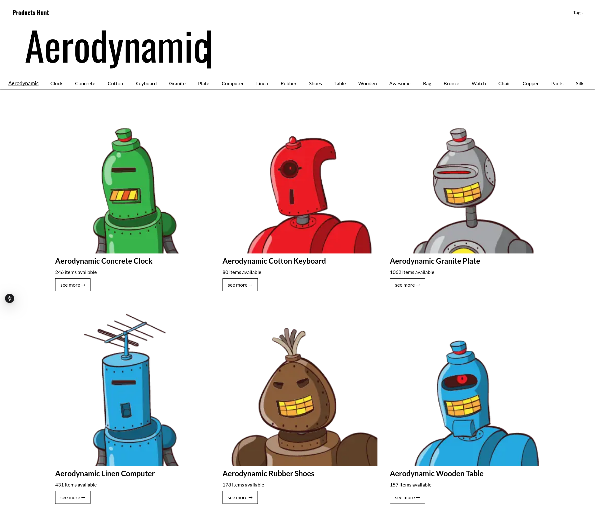
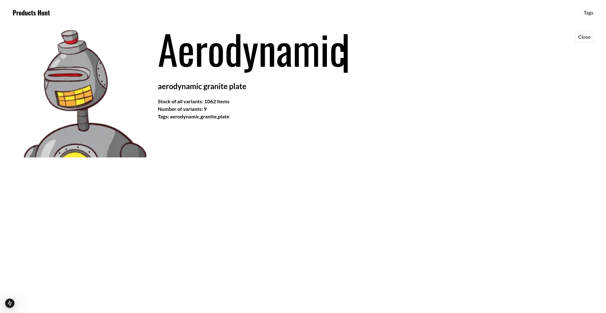

# Dengun Challenge

This project is a web application built with Next.js, React, and Tailwind CSS. It displays a list of products and tags, allowing users to browse and explore different products based on tags.

## Table of Contents

- [Installation](#installation)
- [Screenshots](#screenshots)
- [Usage](#usage)
- [Project Structure](#project-structure)
- [Components](#components)
- [API Endpoints](#api-endpoints)
- [Technologies Used](#technologies-used)
- [License](#license)

## Installation

1. Clone the repository:
    ```sh
        git clone https://github.com/mccartheney/dengun-challenge
        cd dengun-challenge
    ```

2. Install dependencies:
    ```sh
        npm install
    ```

3. Create a .env file in the root directory and add the api link.
    ```sh
        API_URL="The api url"
    ```

## Screenshots

### Tags List Page


### Aerodynamic Products List Page


### Product Modal



## Usage

1. To start the development server, run:
    ```sh
        npm run dev
    ```
## Project Structure

<pre>
    .env
    .gitignore
    .next/
    package.json
    public/
    README.md
    src/
        app/
        components/
        types/
    tailwind.config.ts
    tsconfig.json
</pre>

- **src/app**: Contains the main application files.
- **src/components**: Contains the React components used in the application.
- **src/types**: Contains TypeScript type definitions.

## Components

### Global Components

- **HeaderComponent**: The header of the application.
- **TagListComponent**: Displays a list of tags.

### Home Components

- **Welcome**: The welcome section of the home page.
- **TrandingTags**: Displays trending tags.
- **AllTags**: Displays all tags.

### Products Components

- **ProductsList**: Displays a list of products.
- **ProductItem**: Displays a single product item.
- **ProductModal**: Displays product details in a modal.

## API Endpoints

- **GET /api/tags**: Fetches all tags.
- **GET /api/products**: Fetches all products.

## Technologies Used
- **Next.js**
- **React**
- **Tailwind CSS**
- **TypeScript**
- **Axios**

## License
This project is licensed under the MIT License. See the [LICENSE](./LICENSE) file for details.